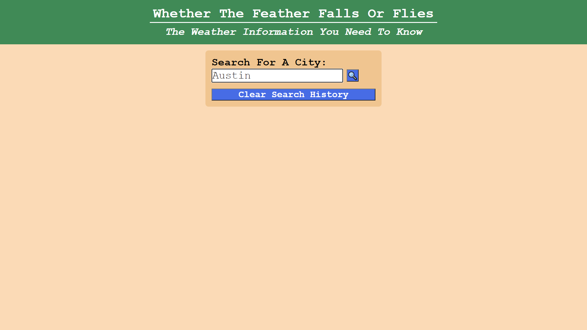
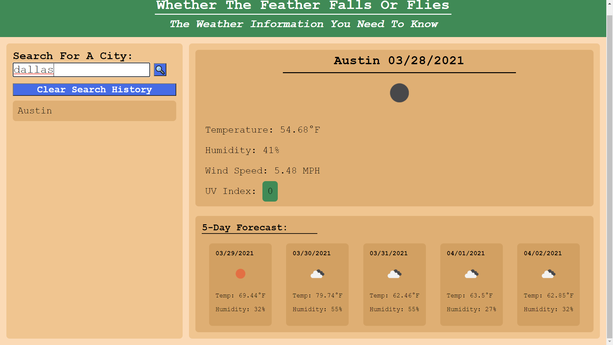
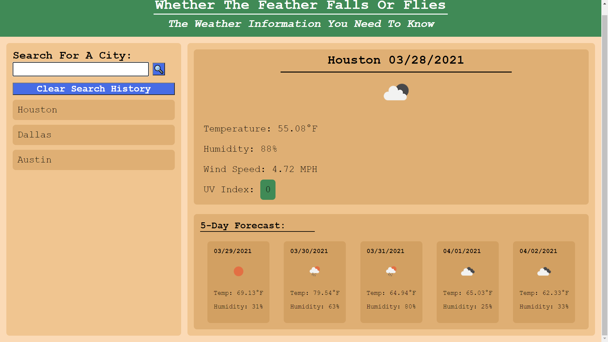

# Whether The Feather Falls Or Flies
This is an application that allows users to search by city name and receive a detailed forecast of today's weather conditions, as well as a five day forecast of weather into the future.

Users are able to search by entering a city in the search bar, or by clicking an item displayed in the search history.

I utilized the <a target="_blank" href="https://openweathermap.org/api">Open Weather Map API</a> to collect the data that is displayed.

Here is a link <a target="_blank" href="https://mikeyrod22.github.io/whether-the-feather-falls-or-flies/">link to the deployed application</a>.

Here are some screenshots of the application:

 

